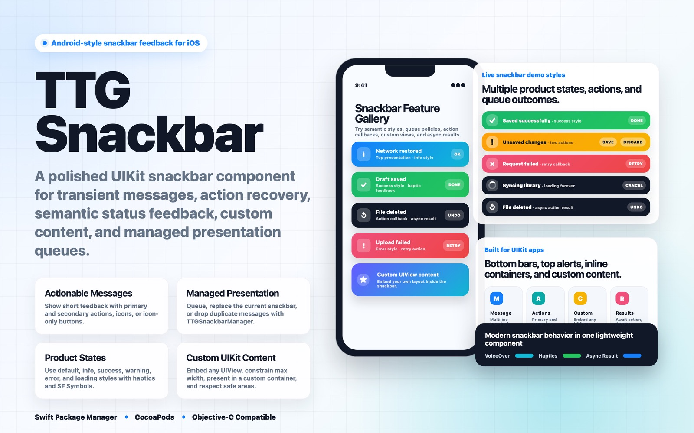
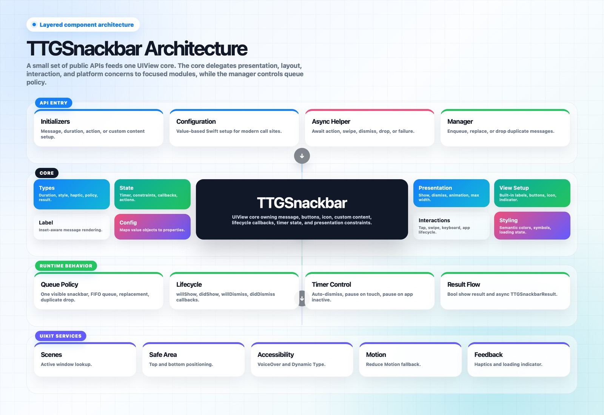
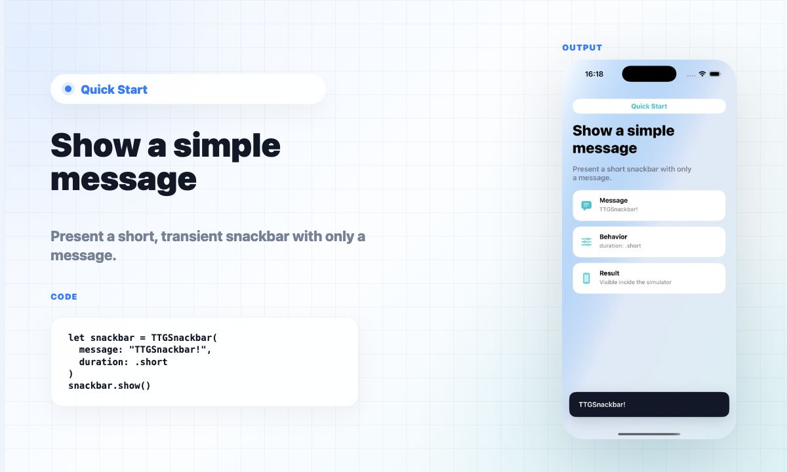
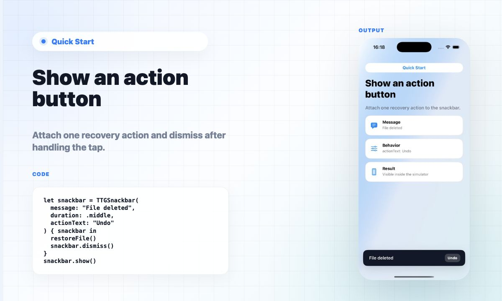
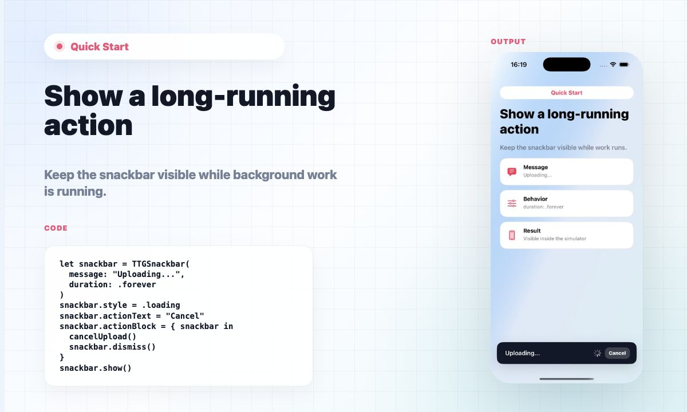
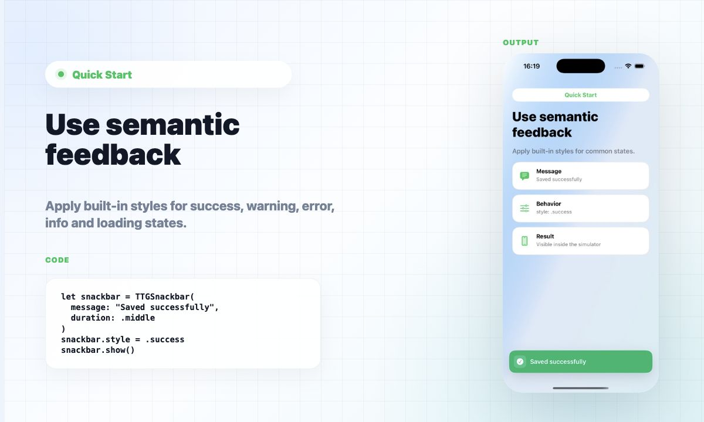
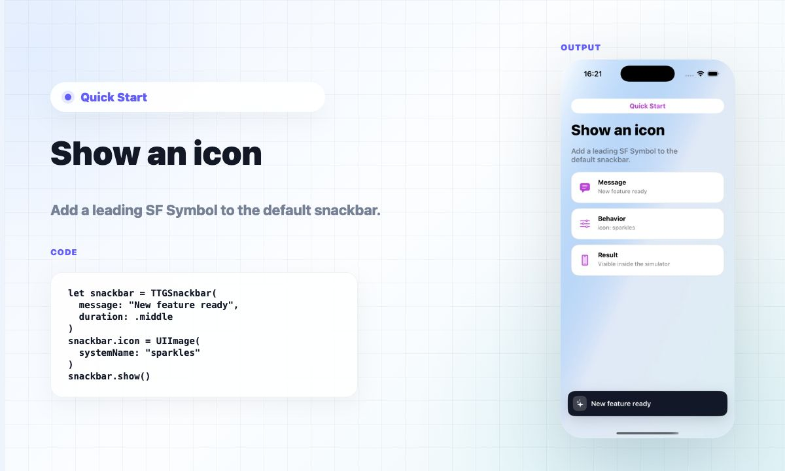
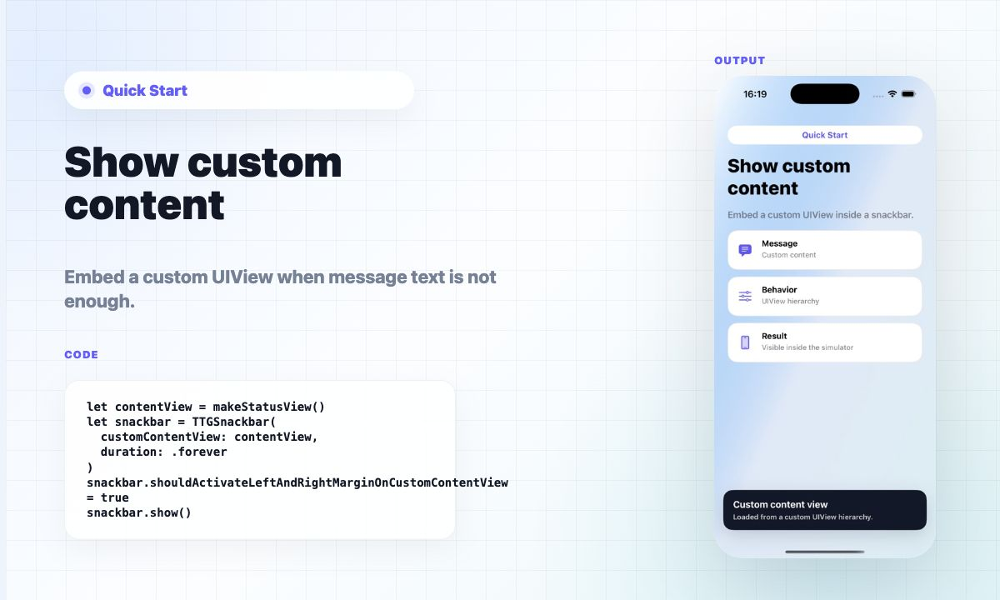

# TTGSnackbar

[简体中文](README.zh-CN.md)

TTGSnackbar is a Swift implementation of an Android-style Snackbar for iOS. It presents short, actionable messages at the top or bottom of the screen, supports custom views, queue management, semantic styles, accessibility, haptics, and Swift concurrency.

> Current development targets **Swift 5.9**, **Xcode 15+**, and **iOS 16.0+**.

[](https://travis-ci.org/zekunyan/TTGSnackbar)
[](https://github.com/zekunyan/TTGSnackbar)
[](https://github.com/zekunyan/TTGSnackbar)
[](https://github.com/zekunyan/TTGSnackbar)
[](https://developer.apple.com/swift)
[](https://github.com/zekunyan/TTGSnackbar)
[](https://github.com/zekunyan/TTGSnackbar)

## Visual Overview





## Features

- Present messages at the bottom or top of the screen.
- Add one or two action buttons, text actions, or icon-only actions.
- Show built-in semantic styles: `default`, `info`, `success`, `warning`, `error`, and `loading`.
- Present custom `UIView` content or display inside a custom container view.
- Queue, replace, or deduplicate snackbars with `TTGSnackbarManager`.
- Await action, tap, swipe, dismiss, drop, or presentation-failure results with Swift concurrency.
- Support Dynamic Type, VoiceOver announcements, Reduce Motion, and haptic feedback.
- Pause and resume dismiss timers manually, on touch, or during app lifecycle interruptions.
- Include a privacy manifest for modern Apple platform requirements.

## Requirements

| TTGSnackbar version | Swift | Xcode | iOS |
| --- | --- | --- | --- |
| Current | 5.9 | 15+ | 16.0+ |
| 1.6.0 | 4.x | 9+ | 8.0+ |
| 1.5.3 | 3.x | 8+ | 8.0+ |

## Installation

### Swift Package Manager

Add this repository URL in Xcode:

```text
https://github.com/zekunyan/TTGSnackbar.git
```

Then import the module:

```swift
import TTGSnackbar
```

### CocoaPods

Add TTGSnackbar to your `Podfile`:

```ruby
pod "TTGSnackbar"
```

Then run:

```sh
pod install
```

### Carthage

Add TTGSnackbar to your `Cartfile`:

```text
github "zekunyan/TTGSnackbar"
```

## Quick Start

All snippets assume the module is already imported:

```swift
import TTGSnackbar
```

The default style works out of the box. Create a snackbar, configure only the behavior you need, then call `show()`.

### 1. Show a simple message

Use this for short confirmation or status text that can disappear automatically.

```swift
let snackbar = TTGSnackbar(message: "TTGSnackbar!", duration: .short)
snackbar.show()
```



`show()` returns `false` if the snackbar cannot be presented, for example when no active window or custom container is available:

```swift
if !snackbar.show() {
    print("Snackbar could not be presented")
}
```

### 2. Add an action button

Use an action when the message should offer an immediate recovery path. Set both the visible title and the callback.

```swift
let snackbar = TTGSnackbar(
    message: "File deleted",
    duration: .middle,
    actionText: "Undo"
) { snackbar in
    restoreFile()
    snackbar.dismiss()
}

snackbar.show()
```



### 3. Keep a snackbar visible while work runs

Use `.forever` for work that should stay visible until the user cancels or your task finishes. The `.loading` style adds the activity indicator.

```swift
let snackbar = TTGSnackbar(
    message: "Uploading…",
    duration: .forever
)

snackbar.style = .loading
snackbar.actionText = "Cancel"
snackbar.actionBlock = { snackbar in
    cancelUpload()
    snackbar.dismiss()
}

snackbar.show()
```



### 4. Use semantic feedback

Use built-in styles instead of hand-picking colors for common product states.

```swift
let snackbar = TTGSnackbar(message: "Saved successfully", duration: .middle)
snackbar.style = .success
snackbar.show()
```



Available styles are `.default`, `.info`, `.success`, `.warning`, `.error`, and `.loading`.

### 5. Add a leading icon

Add an SF Symbol when the message benefits from a compact visual cue.

```swift
let snackbar = TTGSnackbar(message: "New feature ready", duration: .middle)
snackbar.icon = UIImage(systemName: "sparkles")
snackbar.show()
```



You can also use an icon-only action:

```swift
let snackbar = TTGSnackbar(message: "Tap the icon action", duration: .middle)
snackbar.actionIcon = UIImage(systemName: "hand.tap.fill")
snackbar.actionBlock = { snackbar in
    snackbar.dismiss()
}
snackbar.show()
```

### 6. Present custom content

Use a custom `UIView` when a single message label is not enough. The snackbar still manages presentation, margins, safe areas, and dismissal.

```swift
let contentView = UIStackView()
contentView.axis = .vertical
contentView.spacing = 4
contentView.isLayoutMarginsRelativeArrangement = true
contentView.layoutMargins = UIEdgeInsets(top: 16, left: 18, bottom: 16, right: 18)

let titleLabel = UILabel()
titleLabel.text = "Custom content view"
contentView.addArrangedSubview(titleLabel)

let snackbar = TTGSnackbar(customContentView: contentView, duration: .forever)
snackbar.shouldActivateLeftAndRightMarginOnCustomContentView = true
snackbar.show()
```



## Modern APIs

### Semantic styles

Use semantic styles for common product states. Styles apply recommended colors, icons, loading behavior, and haptic defaults.

```swift
let success = TTGSnackbar(message: "Saved successfully", duration: .short)
success.style = .success
success.show()

let loading = TTGSnackbar(message: "Syncing…", duration: .forever)
loading.style = .loading
loading.show()
```

Available styles:

- `.default`
- `.info`
- `.success`
- `.warning`
- `.error`
- `.loading`

### Configuration API

Use `TTGSnackbarConfiguration` to build snackbars from one value object. The property-based API remains supported.

```swift
let snackbar = TTGSnackbar(configuration: .init(
    message: "File deleted",
    duration: .long,
    style: .warning,
    actionText: "Undo",
    actionBlock: { snackbar in
        undoDelete()
        snackbar.dismiss()
    }
))

snackbar.show()
```

### Async / await presentation

Swift concurrency callers can await the first action, tap, swipe, dismiss, manager drop, or presentation failure.

```swift
let result = await TTGSnackbar.show(configuration: .init(
    message: "File deleted",
    duration: .long,
    style: .warning,
    actionText: "Undo"
))

switch result {
case .action:
    undoDelete()
case .dismissed:
    break
case .dropped:
    print("A manager policy dropped the snackbar")
case .failedToPresent:
    print("No window or container was available")
default:
    break
}
```

The async helper wires action titles into result callbacks automatically. With property-based presentation, provide an `actionBlock` or `secondActionBlock` for action buttons to become visible.

### Queue management

`TTGSnackbarManager` ensures only one managed snackbar is visible at a time.

```swift
let snackbar = TTGSnackbar(message: "Queued message", duration: .middle)
TTGSnackbarManager.shared.show(snackbar: snackbar, policy: .enqueue)

let urgent = TTGSnackbar(message: "Network disconnected", duration: .long)
urgent.style = .error
TTGSnackbarManager.shared.show(snackbar: urgent, policy: .replaceCurrent)
```

Available policies:

| Policy | Behavior |
| --- | --- |
| `.enqueue` | Show after the current snackbar is dismissed. |
| `.replaceCurrent` | Dismiss the current snackbar and show this one next. |
| `.dropIfShowingSameMessage` | Drop when the same message is already visible or queued. |

`show(snackbar:policy:)` returns `false` when the snackbar is synchronously dropped or cannot be presented.

```swift
let accepted = TTGSnackbarManager.shared.show(
    snackbar: snackbar,
    policy: .dropIfShowingSameMessage
)
```

Objective-C callers can use the same manager:

```objective-c
TTGSnackbar *bar = [[TTGSnackbar alloc] initWithMessage:@"Bar" duration:TTGSnackbarDurationMiddle];
[[TTGSnackbarManager shared] showSnackbar:bar policy:TTGSnackbarPresentationPolicyEnqueue];
```

## Customization

### Text and actions

| Property | Description |
| --- | --- |
| `message` | Main message text. Supports multiline text and runtime updates. |
| `messageTextColor` | Message text color. |
| `messageTextFont` | Message text font. |
| `messageTextAlign` | Message text alignment. |
| `messageContentInset` | Insets for the message label text. |
| `actionText` | Primary action title. |
| `actionIcon` | Primary action icon. |
| `actionTextColor` | Primary action title color. |
| `actionTextFont` | Primary action font. |
| `actionBlock` | Primary action callback. |
| `secondActionText` | Secondary action title. |
| `secondActionIcon` | Secondary action icon. |
| `secondActionTextColor` | Secondary action title color. |
| `secondActionTextFont` | Secondary action font. |
| `secondActionBlock` | Secondary action callback. |
| `actionMaxWidth` | Maximum action-button width. Minimum value is 44. |
| `actionTextNumberOfLines` | Number of action-button title lines. |

### Duration

`duration` defines how long the snackbar remains visible.

| Duration | Behavior |
| --- | --- |
| `.short` | 1 second. |
| `.middle` | 3 seconds. |
| `.long` | 5 seconds. |
| `.custom` | Uses `customDuration`. Set `customDuration > 0`. Invalid values assert in debug builds and fall back to `.short`. |
| `.forever` | Does not auto-dismiss. Dismiss manually. |

### Layout

| Property | Description |
| --- | --- |
| `animationType` | Show and dismiss animation style. |
| `animationDuration` | Show and dismiss animation duration. |
| `animationSpringWithDamping` | Spring damping used by animations. |
| `animationInitialSpringVelocity` | Initial spring velocity used by animations. |
| `leftMargin`, `rightMargin`, `topMargin`, `bottomMargin` | Snackbar margins. |
| `contentInset` | Insets around the built-in or custom content view. |
| `cornerRadius` | Snackbar corner radius. |
| `snackbarMaxWidth` | Maximum snackbar width. Default is -1, which means full width. |
| `containerView` | Custom superview used for presentation instead of the active window. |
| `customContentView` | Custom content shown inside the snackbar. |
| `shouldActivateLeftAndRightMarginOnCustomContentView` | Makes custom content honor side margins. |
| `shouldHonorSafeAreaLayoutGuides` | Uses safe area layout guides when positioning the snackbar. |

Available animation types:

- `.fadeInFadeOut`
- `.slideFromBottomToTop`
- `.slideFromBottomBackToBottom`
- `.slideFromLeftToRight`
- `.slideFromRightToLeft`
- `.slideFromTopToBottom`
- `.slideFromTopBackToTop`

### Icon and indicator

| Property | Description |
| --- | --- |
| `icon` | Leading icon image. |
| `iconContentMode` | Leading icon content mode. |
| `iconBackgroundColor` | Leading icon background color. |
| `iconTintColor` | Leading icon tint color. |
| `iconImageViewWidth` | Leading icon width. |
| `activityIndicatorViewStyle` | Loading indicator style. |
| `activityIndicatorViewColor` | Loading indicator color. |

### Gestures and dismissal

| Property / Method | Description |
| --- | --- |
| `onTapBlock` | Called when the snackbar is tapped. |
| `onSwipeBlock` | Called when the snackbar is swiped. |
| `shouldDismissOnSwipe` | Automatically dismisses on swipe when enabled. |
| `dismiss()` | Dismisses the snackbar with animation. |
| `pauseDismissTimer()` | Pauses the auto-dismiss timer. |
| `resumeDismissTimer()` | Resumes a paused auto-dismiss timer. |
| `pausesDismissTimerOnTouch` | Pauses timed snackbars while users touch them. |
| `pausesDismissTimerWhenAppInactive` | Pauses timed snackbars while the app is inactive. |

### Lifecycle callbacks

| Callback | Description |
| --- | --- |
| `willShowBlock` | Called before presentation animation starts. |
| `didShowBlock` | Called after presentation animation completes. |
| `willDismissBlock` | Called before dismissal animation starts. |
| `didDismissBlock` | Called after the snackbar is removed from its superview. |
| `dismissBlock` | Legacy dismiss callback kept for compatibility. |

### Accessibility, motion, and haptics

| Property | Description |
| --- | --- |
| `shouldAnnounceForAccessibility` | Posts a VoiceOver announcement when shown. |
| `accessibilityAnnouncement` | Custom VoiceOver announcement. Defaults to `message`. |
| `adjustsFontForContentSizeCategory` | Enables Dynamic Type scaling for built-in labels/buttons. |
| `shouldRespectReduceMotion` | Uses a reduced fade animation when Reduce Motion is enabled. |
| `hapticFeedback` | Feedback played when the snackbar appears. |
| `actionHapticFeedback` | Feedback played when action buttons are tapped. |

## Examples

The repository includes Swift and Objective-C example apps that demonstrate the full feature gallery, including semantic styles, custom content, custom containers, manager policies, timer controls, accessibility, haptics, and async result handling.

## License

TTGSnackbar is released under the MIT license. See [LICENSE](LICENSE) for details.
